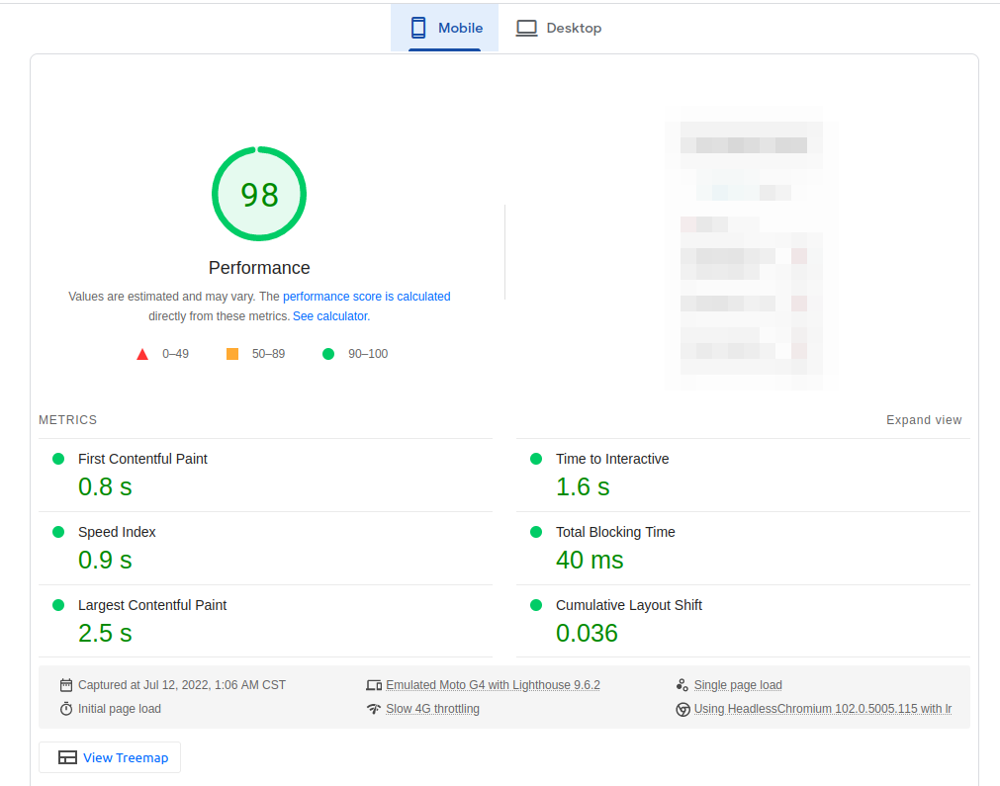
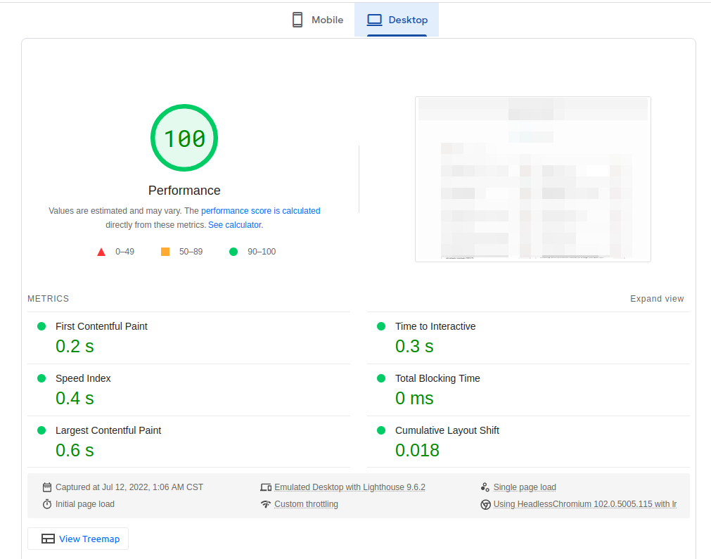

# Hacker News Reader - Web client

Hacker News Reader for web developer. Check the latests news about Angular, ReactJS and VueJS from your favorite device. 

Try it! https://hn4r.netlify.app

## ✨ Features
* Save your favorite stories.
* Fast to load and easy to use (see Performance section below).
* Add the reader to your Home Screen! (without download heavy apps). 
  * iOS: On Safari press the Share button and later choose "Add to home screen" option from the menu.
  * Android: On Chrome or Firefox, open the browser menu and choose the option "Add to home screen"

## 👩‍💻 Technical documentation

* [Generators](docs/generators.md) 
* [Pages](docs/pages.md)
* [Components](docs/components.md)
* [Classes](docs/classes.md)
* [Helpers](docs/helpers.md)
* [Hooks](docs/hooks.md) 
* [Constants](docs/constants.md)

## Performance

Check the [PageSpeed Insights Report](https://pagespeed.web.dev/report?url=https%253A%252F%252Fhn4r.netlify.app%252F) for more information.

 
 